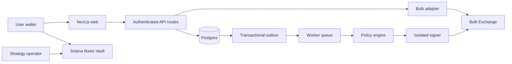

# KLUB architecture

Status: active  
Owner: Klubtrade  
Last reviewed: 2026-07-18

KLUB separates presentation, domain calculations, exchange transport,
persistence, asynchronous execution, signing, and Solana custody.

## Dependency rules

- `apps/web` presents the product and hosts authenticated HTTP adapters. Client
  components must not import database or private signing implementations.
- `apps/worker` owns durable asynchronous workflows. It consumes versioned
  commands and must tolerate duplicate delivery and restart.
- `packages/api-client` is the untrusted Bulk transport boundary. It maps
  runtime-validated DTOs into internal domain models.
- `packages/calc` is deterministic, side-effect-free financial math.
- `packages/db` owns persistence schema and repositories, not public API types.
- `packages/signing` is being narrowed to typed, policy-approved intents. Raw
  arbitrary-payload signing is not an acceptable production interface.
- `programs/basis-vault` is the on-chain custody boundary.

The target package split adds `domain`, `application`, `bulk-adapter`,
`validation`, and `observability` as shared boundaries without forcing a
big-bang rewrite. See the remediation ledger for migration status.
