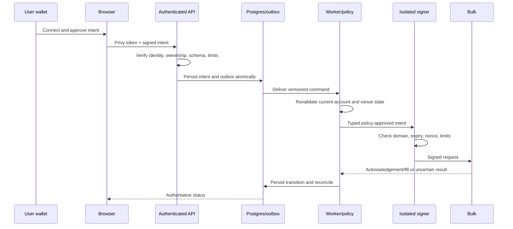

# Trust model

Status: active testnet policy  
Owner: Klubtrade  
Last reviewed: 2026-07-18

## Security claims

KLUB does not need or receive a user's wallet seed phrase. User-signed trading
uses the connected wallet. Optional unattended execution may eventually use a
separate, revocable, policy-limited agent authority. That authority is not the
user's wallet and must never have withdrawal permission.

The current Basis Vault is a public-testnet, prefunded yield-distribution
model. Deposited principal remains in the Solana vault. Strategy trades use
operator capital outside the vault, and yield becomes claimable only when the
operator transfers corresponding mock USDC into vault custody. It is not yet a
user-capital strategy vault or a claim over a Bulk strategy account.

## Components and authority

| Component           | Trusted for                                               | Must not be able to                                               |
| ------------------- | --------------------------------------------------------- | ----------------------------------------------------------------- |
| User wallet         | User identity and explicit signatures                     | Be impersonated from browser state                                |
| Privy               | Authentication and wallet linking                         | Authorize financial actions without server verification           |
| Web/browser         | Presentation and collecting intent                        | Hold server secrets, trust itself as identity, or sign unattended |
| Next.js server      | Authentication, validation, policy entry, public proxying | Arbitrarily sign or silently expand an intent                     |
| Postgres            | Durable operational state and audit metadata              | Become venue truth or contain plaintext private keys              |
| Redis/queue         | Delivery, locks, short-lived rate-limit state             | Be the only record of a financial transition                      |
| Worker              | Versioned workflow execution and reconciliation           | Exceed user policy or treat timeouts as definite failure          |
| Signing boundary    | Sign an approved typed intent                             | Accept arbitrary bytes, withdraw, or export keys                  |
| Bulk Exchange       | Venue orders, positions, collateral, and fills            | Define KLUB identity or mutate KLUB policy                        |
| Basis Vault program | Enforce SPL custody and accounting                        | Move funds outside its instruction invariants                     |
| Vault admin         | Configuration and narrowly scoped pauses                  | Withdraw user funds or silently change mint                       |
| Strategy authority  | Transfer funded yield into the vault                      | Withdraw principal or alter user ownership                        |

## Compromise impact

| Compromised component  | Maximum intended impact                                  | Enforced mitigation                                                     |
| ---------------------- | -------------------------------------------------------- | ----------------------------------------------------------------------- |
| Browser/web deployment | Phishing UI and malicious requests                       | Wallet-visible signing, server auth, CSP, deployment monitoring         |
| Next.js server         | Read authorized app data and request allowed operations  | No user private keys; typed signer policy; independent worker checks    |
| Database               | Corrupt operational state and expose stored profile data | Venue reconciliation, append-only audit, constraints, encrypted backups |
| Redis                  | Delay, duplicate, or drop jobs                           | Durable command/outbox state and idempotent consumers                   |
| Worker                 | Attempt trades within delegated scope                    | Independent signing policy, limits, expiry, revocation, kill switch     |
| Strategy key           | Credit yield it actually funds                           | On-chain transfer in the same instruction; no withdrawal authority      |
| Admin key              | Pause/configure within program rules                     | Multisig, fee cap, immutable mint, monitored upgrades                   |

## Data flow

## Always user-signed

- linking or replacing a user-controlled wallet;
- granting, expanding, or rotating delegated automation authority;
- changing a withdrawal destination;
- depositing into or withdrawing from the Basis Vault; and
- any action outside an active delegated policy.

The production signer design remains incomplete until the controls in
[`signing-architecture.md`](signing-architecture.md) are implemented and
runtime verified.
